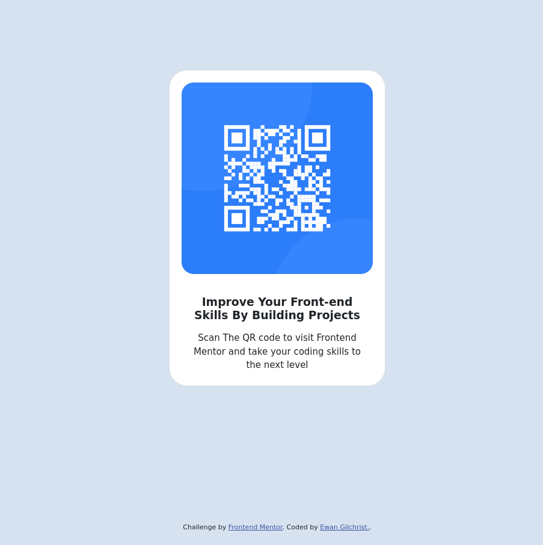

# Frontend Mentor - QR code component solution

This is a solution to the [QR code component challenge on Frontend Mentor](https://www.frontendmentor.io/challenges/qr-code-component-iux_sIO_H).

## Table of contents

- [Overview](#overview)
  - [Screenshot](#screenshot)
- [Process](#processProcess)
  - [Built with](#built-with)

## Overview

### Screenshot

## Process

I wanted to focus on improving my CSS and knowledge of the Bootstrap library. I found using bootstrap components as a starting point very useful and it made the whole design process much quicker.

### Built with

- Semantic HTML5 markup
- CSS custom properties
- Flexbox
- CSS Grid
- Mobile-first workflow
